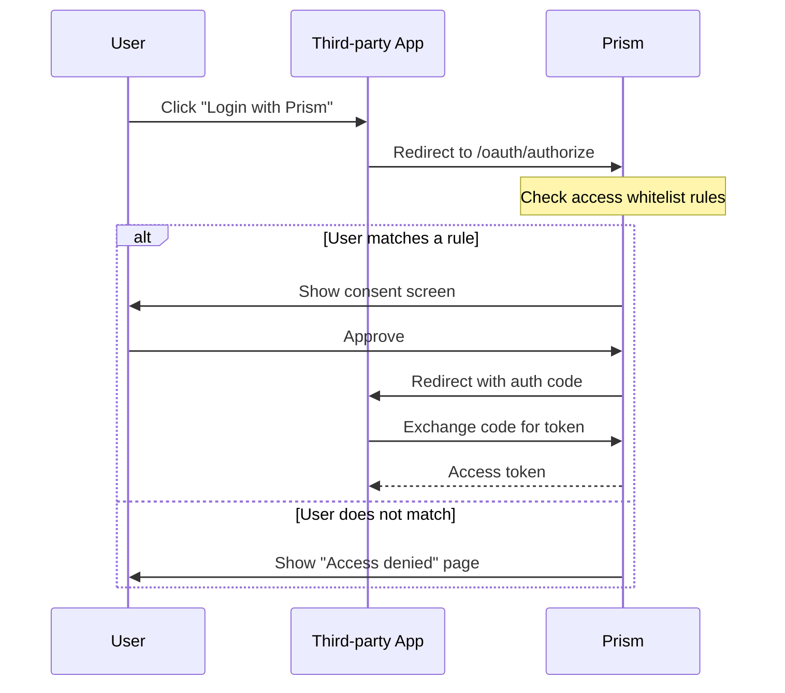

# App Access Whitelist

Some downstream applications (e.g. frp, self-hosted tools) don't natively support
JWT claims-based access control — they can't read `in_team_*` or `role_in_team_*`
claims and enforce membership on their own. The **App Access Whitelist** feature lets
Prism enforce this at the gate, before the user ever reaches the app.

When enabled, the OAuth authorization flow checks the user against a set of rules.
Users who don't match any rule are redirected to an "Access denied" page instead
of the consent screen.

**How it works**

- The app owner enables the whitelist toggle in the app's settings
- They add rules specifying which **teams** or **users** may authorize
- Team rules can optionally require a **minimum role** (owner, co-owner, admin, or member)
- Multiple rules are **OR'd** — matching any single rule grants access
- If the toggle is on but no rules are configured, **no one** can access the app

---

## Configuring the whitelist

### 1. Open the app in the dashboard

Navigate to **My Apps** → select the app → click the **Access whitelist** tab.

### 2. Enable the whitelist

Toggle **Enable access whitelist** to on.

### 3. Add rules

Click **Add rule** and choose:

| Field             | Description                                                                   |
|-------------------|-------------------------------------------------------------------------------|
| Rule type         | **Team** — all members of a team can access. **User** — a single user can access. |
| Target            | Select a team from the dropdown, or enter a user ID.                          |
| Minimum role      | (Team only) The lowest role a member must have. Choose from owner, co-owner, admin, or member. |

You can add as many rules as you need. A user needs to match at least one rule
to pass the whitelist check.

### 4. Remove rules

Each rule row has a delete button. Removing a rule takes effect immediately.

---

## How it works during authentication



The check happens inside `GET /api/oauth/app-info` — after the user has
authenticated but **before** the consent screen is rendered. If the user
doesn't match, the API returns `403` with:

```json
{
  "error": "unauthorized_whitelist",
  "app_name": "Your App Name"
}
```

The frontend catches this and redirects to `/unauthorized?app_name=...`,
where the user sees the app name and a "Go back" button.

---

## API management

The whitelist rules can also be managed via API (requires write access to the app):

### List rules

```bash
curl https://your-prism.example/api/apps/<app_id>/access-rules \
  -H "Authorization: Bearer <token>"
```

Response:

```json
{
  "rules": [
    {
      "id": "rul_abc123",
      "app_id": "app_xyz789",
      "rule_type": "team",
      "target_id": "team_456",
      "min_role": "admin",
      "created_at": 1711200000
    },
    {
      "id": "rul_def456",
      "app_id": "app_xyz789",
      "rule_type": "user",
      "target_id": "usr_abc",
      "min_role": null,
      "created_at": 1711200100
    }
  ]
}
```

### Add a rule

```bash
curl -X POST https://your-prism.example/api/apps/<app_id>/access-rules \
  -H "Authorization: Bearer <token>" \
  -H "Content-Type: application/json" \
  -d '{
    "rule_type": "team",
    "target_id": "team_456",
    "min_role": "admin"
  }'
```

### Delete a rule

```bash
curl -X DELETE https://your-prism.example/api/apps/<app_id>/access-rules/<rule_id> \
  -H "Authorization: Bearer <token>"
```

---

## Limitations

- **No public API for listing users.** You must know the user's ID to create a user rule.
  Team rules with a dropdown are the primary workflow.
- The whitelist is evaluated at authorization time. Revoking a user from a team
  immediately prevents future logins, but does not invalidate existing access tokens
  for that app — the app owner should also revoke the token if needed.
- Sub-team inheritance is respected: if a team rule allows access and the user
  is a member of a sub-team, they pass the check via effective membership.
