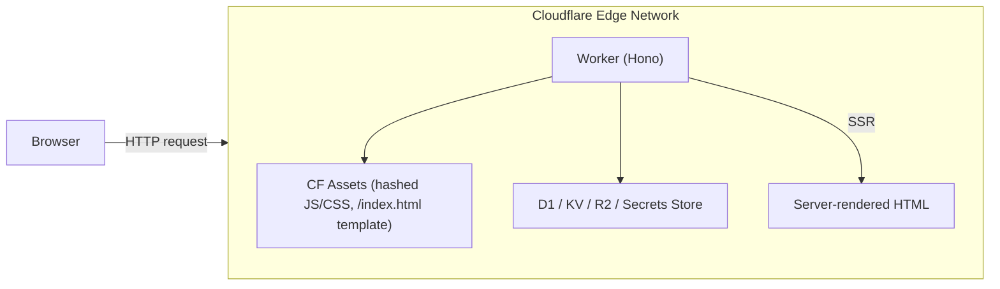
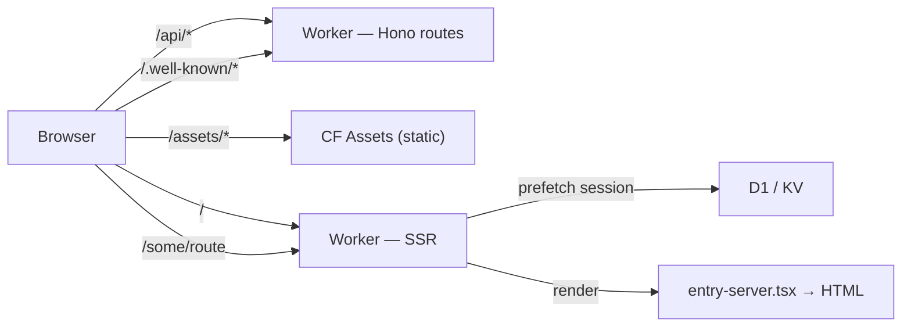
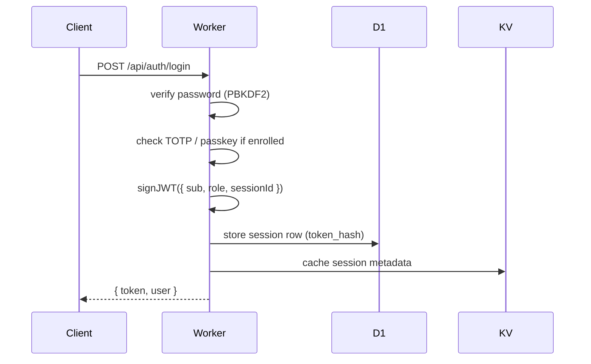
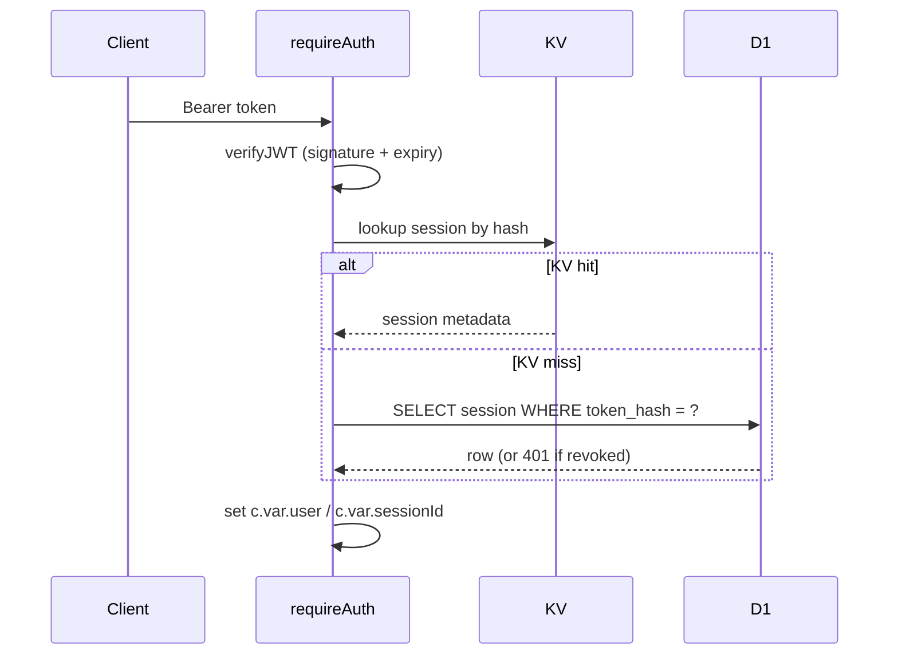

# Architecture

## Overview

Prism is a monorepo with two main parts:

- **Backend** (`worker/`) — a Cloudflare Worker written in TypeScript with [Hono](https://hono.dev)
- **Frontend** (`src/`) — a React 19 SPA built with Vite, served from Cloudflare Assets, and **server-side rendered by the same Worker** for the initial HTML response



A single `wrangler deploy` publishes both the Worker and the built frontend assets.
The build script generates a deploy-ready `wrangler.json` next to the Vite-bundled
worker output so Vite's SSR pass is preserved.

## Request flow

`html_handling: "none"` is set on the assets binding — Cloudflare's auto
fallback to `index.html` is disabled so the Worker can render every HTML route
itself. Hashed JS/CSS bundles in `/assets/` and explicitly-named static files
(`/favicon.svg`, `/pow.wasm`, etc.) are still served from Cloudflare Assets
directly without invoking the Worker.



The Worker reads the session cookie up front, prefetches the authenticated user
when present, and hands both the locale and prefetched data to the React render
pass — so logged-in pages don't flash an unauthenticated state before hydration.

The [Cloudflare Vite plugin](https://developers.cloudflare.com/workers/vite-plugin/)
runs the Worker in-process alongside Vite during development (`bun dev`), so API
requests hit the real Worker runtime without a separate `wrangler dev` process,
and `entry-server.tsx` is hot-reloaded just like client code.

## Worker structure

```text
worker/
├── index.ts                # App entry; CORS, secureHeaders, route mounting, scheduled(), email()
├── ssr.ts                  # SSR glue → src/entry-server.tsx
├── types.ts                # D1 row types, Variables, SiteConfig
│
├── db/migrations/
│   └── 0001_init.sql … 0046_oauth_source_icon.sql
│
├── lib/
│   ├── config.ts           # getConfig(), setConfigValues(), JWT secret, RSA keypair (KV)
│   ├── secretCrypto.ts     # AES-GCM envelope + keyed HMAC for D1 fields (SECRETS_KEY)
│   ├── crypto.ts           # randomId, hashPassword/verifyPassword (PBKDF2)
│   ├── pow.ts              # Signed challenge issue/verify (HMAC + expiry + single-use)
│   ├── jwt.ts              # signJWT / verifyJWT (HS256), RS256 ID-token signing
│   ├── totp.ts             # TOTP / HOTP (RFC 6238), backup codes
│   ├── webauthn.ts         # Passkey registration/authentication via @simplewebauthn/server
│   ├── gpg.ts              # GPG clearsign verification (mldsa.ts for ML-DSA support)
│   ├── mldsa.ts            # ML-DSA (post-quantum) signature verification
│   ├── email.ts / imap.ts  # Send (Resend / Mailchannels / SMTP) + receive (Email Workers / IMAP poll)
│   ├── notifications.ts    # User-facing email & Telegram notifications
│   ├── notificationRules.ts# Ruleset engine — globs, accounts, send/drop, stop
│   ├── webhooks.ts         # Outgoing webhook delivery + signature
│   ├── proxyImage.ts       # Closed image-proxy mappings (registerImageProxyMapping)
│   ├── safeFetch.ts        # SSRF guard (blocks RFC1918 / link-local / etc.)
│   ├── imageValidation.ts  # Reject suspicious image URLs / SVG payloads
│   ├── teamRequirements.ts # Site-floor + team-level join requirement merge
│   ├── domainOwnership.ts  # DNS TXT, HTML meta, .well-known verification methods
│   ├── domainVerify.ts     # Cron re-verify (lib/cron/reverify.ts entrypoint)
│   ├── githubReadme.ts     # Pull + cache GitHub user-repo README, ETag-aware
│   ├── sudo.ts             # Step-up grace window storage in KV
│   ├── scopes.ts           # Scope ↔ claim mapping + cross-app scope parsing
│   ├── redirectUri.ts      # OAuth redirect URI validation, registered-domain check
│   ├── cookies.ts          # Session cookie helpers
│   └── logger.ts           # Request logger middleware
│
├── middleware/
│   ├── auth.ts             # requireAuth / requireAdmin / optionalAuth
│   ├── captcha.ts          # verifyCaptchaToken() — dispatches to provider
│   └── rateLimit.ts        # KV sliding-window rate limiter (IPv6-aware)
│
├── cron/
│   ├── reverify.ts         # Domain re-verification sweep
│   └── imap-poll.ts        # Pull verification emails from an IMAP mailbox
│
├── handlers/
│   └── email.ts            # Cloudflare Email Workers handler (verify-<code>@<host>)
│
└── routes/
    ├── init.ts             # First-run setup
    ├── auth.ts             # Register, login, TOTP, passkeys, GPG, sessions, PoW
    ├── oauth.ts            # Authorization server, token endpoint, OIDC, step-up 2FA, /me/* APIs
    ├── apps.ts             # OAuth app CRUD + scope definitions/access rules
    ├── teams.ts            # Teams, members, invites, transfers, team domains/apps
    ├── domains.ts          # Domain verification (TXT/meta/well-known)
    ├── connections.ts      # Social OAuth flows (incl. Telegram)
    ├── user.ts             # Profile, avatar, password, emails, notifications, PATs, webhooks
    ├── users.ts            # GET /api/users/:username (public profile JSON)
    ├── public-teams.ts     # GET /api/public/teams/:id (public team JSON)
    ├── gpg.ts              # GPG key management (session-auth)
    ├── public.ts           # /users/:username.gpg, /favicon, etc.
    ├── proxy.ts            # GET /api/proxy/image/:id (closed image-proxy mappings)
    ├── site.ts             # GET /api/site (public site config)
    ├── assets.ts           # /api/assets/* — uploaded avatars, app icons (R2 fallback to inline)
    ├── wellknown.ts        # /.well-known/openid-configuration, /.well-known/jwks.json
    └── admin.ts            # Admin: config, users, apps, teams, audit log, request logs, secrets migration
```

## Data model

The schema lives in `worker/db/migrations/`. New deployments run all migrations
in order; existing deployments only run new ones. Highlights:

### `users`

Core identity record. `password_hash` is nullable (accounts created via social
login have no password). `role` is `user` or `admin`.

`kind` distinguishes real humans (`user`) from synthetic team-as-user rows
(`kind = 'team'`, id matches `teams.id`). Team-kind rows exist only so
`oauth_apps.owner_id` can join to a single `users` table for both personal and
team-owned apps; they have no password, no sessions, no social connections, and
cannot log in.

The `users` row also carries the public-profile flags (`profile_is_public`,
`profile_show_*`), the optional self-written README (`profile_readme`,
`profile_readme_source`), and per-user TTL overrides for OAuth tokens.

### `sessions`

`id` matches the `sessionId` claim in the issued JWT and is what the auth
middleware looks up on every request. `token_hash` is `SHA-256(token)` — stored
so a leaked DB row alone cannot be replayed as a token. On logout or admin
revocation the row is deleted, invalidating any still-unexpired JWT because the
middleware always cross-checks D1.

### `totp_authenticators` / `user_totp_recovery`

`totp_authenticators` holds one row per registered authenticator (renamed from
`totp_secrets` in migration 0004 to support multiple authenticators per user);
`enabled = 0` while setup is in progress. `user_totp_recovery` holds one row
per user with `backup_codes` — a JSON array where each entry is either a
SHA-256 hash prefixed `$sha256$…` (consumed on use) or a legacy plaintext code
from before hashing was introduced.

### `passkeys`

WebAuthn credentials. `credential_id` is base64url-encoded. `counter` is updated
on every successful authentication for clone detection.

### `gpg_keys`

Registered GPG public keys for `gpg-login` and the federated `/users/:u.gpg`
lookup. Includes ML-DSA (post-quantum) keys via `lib/mldsa.ts`. The
`gpg_challenge_prefix` site config injects extra lines into the clearsign
payload so users can verify the challenge they're signing.

### `oauth_apps`

Apps registered by users. `client_secret` is encrypted at rest (AES-GCM via
`SECRETS_KEY`) and verified through the timing-safe helpers in
`secretCrypto.ts`. `is_verified` is set by admins. `team_id` is non-null when
the app is owned by a team. `oidc_fields` controls which scope-gated claims are
embedded in the ID token. `use_jwt_tokens` toggles whether issued access tokens
are JWTs (RS256-signed, locally verifiable) or opaque (introspection-only).
`allow_self_manage_exported_permissions` lets the app manage its own scope
definitions via HTTP Basic auth.

### `oauth_codes` / `oauth_2fa_challenges` / `oauth_2fa_codes`

Short-lived (10 min) authorization codes. Step-up 2FA has its own challenge and
code rows so the action text and redirect URI are pinned at server-to-server
challenge creation rather than the redirect URL.

### `oauth_tokens`

Access and refresh tokens. By default `access_token` is a random opaque string
that is looked up in this table on every API request; the stored value is
keyed-HMAC-hashed at rest (legacy plaintext rows continue working until
migrated). Apps can opt into post-quantum **ML-DSA-65** signed JWT access
tokens (RFC 9068 `at+JWT`) by setting `oauth_apps.use_jwt_tokens = 1`; the
`oauth_tokens` row is still kept so revocation works in both modes (`jti`
matches `oauth_tokens.id`). Per-user TTL overrides on `users` win over the
site default.

### `oauth_consents`

Records which scopes a user has already approved for a given client. Used to
skip the consent screen on repeat authorizations.

### `personal_access_tokens`

Long-lived API tokens prefixed `prism_pat_`. Stored as keyed-HMAC hashes;
plaintext is shown only once at creation.

### `oauth_sources`

OAuth providers configured in **Admin → OAuth Sources**: built-in (GitHub,
Google, Microsoft, Discord, Telegram, X) plus Generic OIDC and Generic OAuth 2.
Each source has its own slug, enabled flag, and (for OIDC/OAuth2) issuer / auth
/ token / userinfo URLs. The same provider type can have multiple sources.
`client_secret` is encrypted at rest.

### `domains`

Domains added by users / teams for OAuth redirect URI validation.
`verification_method` is one of `dns-txt`, `html-meta`, `well-known`. Re-verify
runs on the cron schedule using whichever method was originally used.

### `social_connections`

Linked social provider accounts. `(user_id, slug)` is unique — one account per
source slug per user. `(slug, provider_user_id)` is also unique, preventing the
same external account from being linked to multiple Prism accounts.

### `user_emails`

Secondary emails per user. Each row carries `verified`, `verify_token`, and
`verify_code` (the latter for the user-sends-an-email verification path). The
primary email lives on `users.email` for back-compat.

### `webhooks` / `webhook_deliveries`

User and admin webhooks share the same table (distinguished by `user_id IS
NULL`). Deliveries are best-effort, signed with HMAC-SHA256, and retained for
audit.

### `app_event_queue` / `app_webhooks`

Outbound app-notification fan-out (`user.token_granted`, `user.token_revoked`,
`user.updated`). Queue rows feed both the per-app webhook senders and the SSE /
WebSocket streams.

### `notification_rules` (legacy) / `notification_rulesets`

`user_notification_prefs` carries the legacy per-event preference map plus the
canonical `notification_rules` JSON. `notification_rulesets` is the named
ruleset table — an ordered array of `match` / `action` / `stop` rules walked
top-to-bottom for each event. See [Notifications](notifications.md).

### `image_proxy_mappings`

The image proxy is no longer an open relay. Outgoing image references register
a server-side mapping (`registerImageProxyMapping`) that maps an opaque ID to
the source URL. `/api/proxy/image/:id` 404s on anything not in the table. The
cron sweeps mappings whose source row has been deleted.

### `site_config`

Flat key/value store. Values are JSON-encoded strings so booleans and numbers
round-trip correctly. Sensitive keys (listed in `SENSITIVE_CONFIG_KEYS` in
`secretCrypto.ts`) are AES-GCM encrypted on write and transparently decrypted
on read via `getDecryptedConfig()`.

### `audit_log` / `request_logs` / `login_errors`

Three independent diagnostic tables. `audit_log` is the high-level "important
state changed" log. `request_logs` is per-Worker-request operational telemetry
(method, path, status, duration, IP, UA, optional user/audit linkage).
`login_errors` records failed authentication attempts with retention controlled
by `login_error_retention_days`.

### `pow_used`

Single-use PoW nonces. Atomic `INSERT OR IGNORE` claim prevents replay; the
cron purges expired rows.

## Authentication flow



On each authenticated request:



## PoW (Proof of Work)

The PoW system is an alternative to third-party captcha services.

1. `GET /api/auth/pow-challenge` — server returns `{ challenge, difficulty, expires_at }`. The `challenge` is `base64url(payload || HMAC-SHA256(secret, payload))` where `payload = version(1) || expiry_be64(8) || random(16)`. The HMAC key is derived from the JWT secret with a `\0pow-v1` suffix. No server-side state is written at issue time.
2. Client calls `solvePoW(challenge, difficulty)`. The solver spawns one Web Worker per logical core (`navigator.hardwareConcurrency`, capped at 8); worker `k` of `N` searches nonces `k, k+N, k+2N, …`. Each worker prefers WASM (`pow/src/lib.rs`, sha2 crate, `Sha256::clone()` for midstate caching) and falls back to a synchronous JS SHA-256 with the same midstate trick. First worker to find a hit wins; the rest are terminated.
3. Client submits `{ pow_challenge, pow_nonce }` with the registration/login request.
4. Server calls `verifyPowChallenge()`: decode → recompute HMAC and constant-time compare → check expiry → atomically claim the 16-byte payload nonce in `pow_used` via `INSERT OR IGNORE` (replay protection) → finally check `SHA-256(challenge_string || nonce_be32)` has `difficulty` leading zero bits. The cron sweep prunes expired `pow_used` rows.

## Secrets at rest

Sensitive values fall into two categories with different storage strategies,
both rooted in the `SECRETS_KEY` Cloudflare Secrets Store binding:

- **Reversible (AES-GCM envelope)** — values the worker needs to *read back*:
  OAuth/source `client_secret`s, captcha secret keys, SMTP/IMAP passwords, the
  GitHub README site PAT. Ciphertext rows start with `__ENC_v1__`.
- **Verify-only (keyed HMAC-SHA256)** — bearer-style values the worker only
  ever needs to *compare* against a candidate: PATs, OAuth access/refresh
  tokens, OAuth codes, invite tokens, email-verify tokens, 2FA codes,
  individual backup codes. Hash rows start with `__HASH_v1__`. The HMAC subkey
  is HKDF-derived from `SECRETS_KEY` (info `prism:hash-subkey:v1`) for domain
  separation.

When `SECRETS_KEY` is unbound the helpers degrade to no-ops and legacy plaintext
rows continue to match — so existing deployments can opt into encryption with a
single binding addition and a migration click.

## Security notes

- All cryptography uses the **Web Crypto API** plus `@noble/post-quantum` — no Node.js `crypto` module
- Passwords are hashed with **PBKDF2** (100,000 iterations, SHA-256, 16-byte random salt)
- Session JWTs are signed with **HMAC-SHA256**; the signing secret lives in KV
- OIDC ID tokens default to **ML-DSA-65** (post-quantum, FIPS 204); RS256 remains available for legacy clients (JWKS at `/.well-known/jwks.json`)
- OAuth access tokens are opaque random strings by default; apps can opt into **ML-DSA-65** signed JWTs (RFC 9068 `at+JWT`)
- TOTP uses **HMAC-SHA1** per RFC 6238, with a ±1 step window; backup codes are stored SHA-256 hashed
- PKCE uses **S256** (plain is also accepted for backward compatibility)
- Rate limiting uses a KV-backed sliding window with IPv6 prefix bucketing
  (`ipv6_rate_limit_prefix`, default `/64`)
- Sessions are revalidated against D1 on every authenticated request, so deleting the row immediately invalidates still-unexpired JWTs
- All redirect URIs are checked against the app's registered list and the
  domain's verified-ownership state before issuing a code
- Image proxy is closed: only registered URL → opaque-id mappings are served,
  preventing the worker from being used as an open SSRF relay
- SVGs proxied through the image endpoint are sanitized (script blocks, event
  handlers, `javascript:` pseudo-URLs, foreignObject, external `<use>`)
