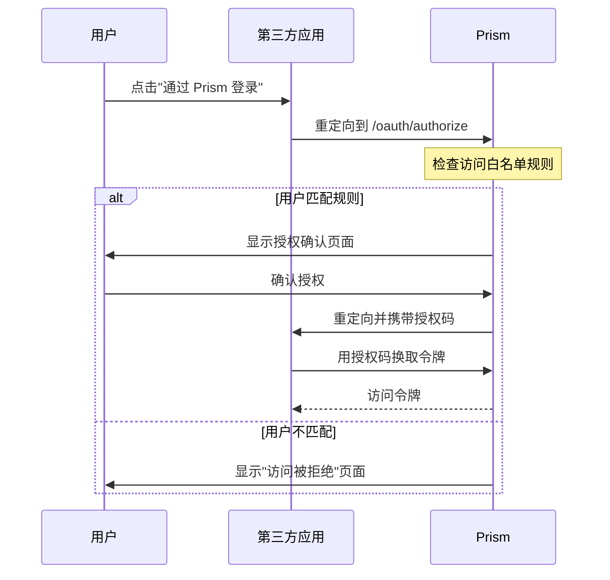

# 应用访问白名单

一些下游应用（如 frp、自托管工具）本身不支持基于 JWT claims 的访问控制 ——
它们无法读取 `in_team_*` 或 `role_in_team_*` 声明并自行强制执行成员资格检查。
**应用访问白名单** 功能让 Prism 在用户到达应用之前就进行拦截检查。

启用后，OAuth 授权流程会对用户进行规则匹配检查。未匹配到任何规则的用户将被
重定向到"访问被拒绝"页面，而不是看到授权确认界面。

**工作原理**

- 应用所有者在应用设置中开启白名单开关
- 添加规则，指定哪些**团队**或**用户**可以进行授权
- 团队规则可以设置**最低角色**要求（所有者、共同所有者、管理员或成员）
- 多条规则之间是**或逻辑**关系 —— 匹配任意一条即可通过
- 如果开启了开关但没有配置任何规则，**任何人都无法访问**该应用

---

## 配置白名单

### 1. 在仪表盘中打开应用

导航到 **我的应用** → 选择应用 → 点击 **访问白名单** 标签页。

### 2. 开启白名单

将 **启用访问白名单** 切换为开启状态。

### 3. 添加规则

点击 **添加规则** 并选择：

| 字段     | 说明                                                                         |
| -------- | ---------------------------------------------------------------------------- |
| 规则类型 | **团队** — 团队中所有成员均可访问。**用户** — 单个用户可访问。               |
| 目标     | 从下拉菜单中选择团队，或输入用户 ID。                                        |
| 最低角色 | （仅限团队）成员必须拥有的最低角色。可选：所有者、共同所有者、管理员、成员。 |

您可以添加任意数量的规则。用户只需匹配其中一条即可通过白名单检查。

### 4. 删除规则

每条规则行都有一个删除按钮，删除后立即生效。

---

## 认证流程中的检查



检查在 `GET /api/oauth/app-info` 中执行 —— 用户已认证但**尚未看到**授权确认
页面。如果用户不匹配，API 返回 `403` 和：

```json
{
  "error": "unauthorized_whitelist",
  "app_name": "您的应用名称"
}
```

前端捕获此错误并重定向到 `/unauthorized?app_name=...`，
用户会看到应用名称和一个"返回"按钮。

---

## API 管理

白名单规则也可以通过 API 管理（需要对应用的写权限）：

### 列出规则

```bash
curl https://your-prism.example/api/apps/<app_id>/access-rules \
  -H "Authorization: Bearer <token>"
```

响应：

```json
{
  "rules": [
    {
      "id": "rul_abc123",
      "app_id": "app_xyz789",
      "rule_type": "team",
      "target_id": "team_456",
      "min_role": "admin",
      "created_at": 1711200000
    },
    {
      "id": "rul_def456",
      "app_id": "app_xyz789",
      "rule_type": "user",
      "target_id": "usr_abc",
      "min_role": null,
      "created_at": 1711200100
    }
  ]
}
```

### 添加规则

```bash
curl -X POST https://your-prism.example/api/apps/<app_id>/access-rules \
  -H "Authorization: Bearer <token>" \
  -H "Content-Type: application/json" \
  -d '{
    "rule_type": "team",
    "target_id": "team_456",
    "min_role": "admin"
  }'
```

### 删除规则

```bash
curl -X DELETE https://your-prism.example/api/apps/<app_id>/access-rules/<rule_id> \
  -H "Authorization: Bearer <token>"
```

---

## 限制

- **没有公开的用户列表 API。** 创建用户规则时需要知道用户的 ID。
  带有下拉选择的团队规则是主要的工作流程。
- 白名单在授权阶段进行检查。将用户从团队中移除会立即阻止后续登录，
  但不会使该应用的已有访问令牌失效 —— 如有需要，应用所有者应另外撤销令牌。
- 子团队继承得到支持：如果团队规则允许访问且用户是某个子团队的成员，
  他们将通过有效成员资格检查。
