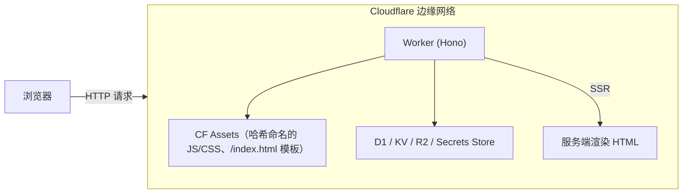
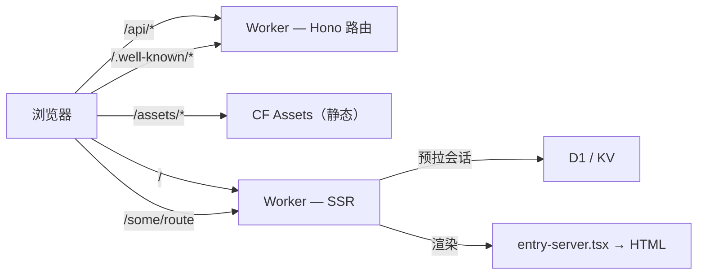
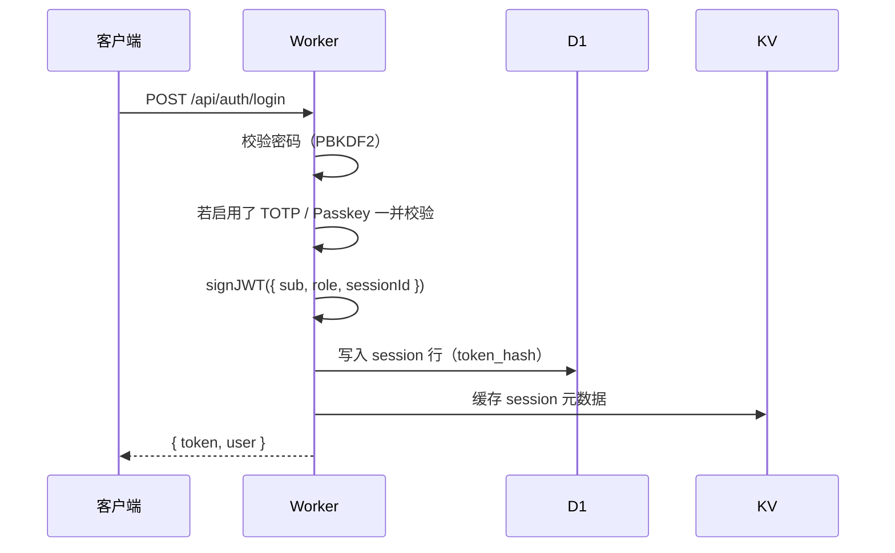
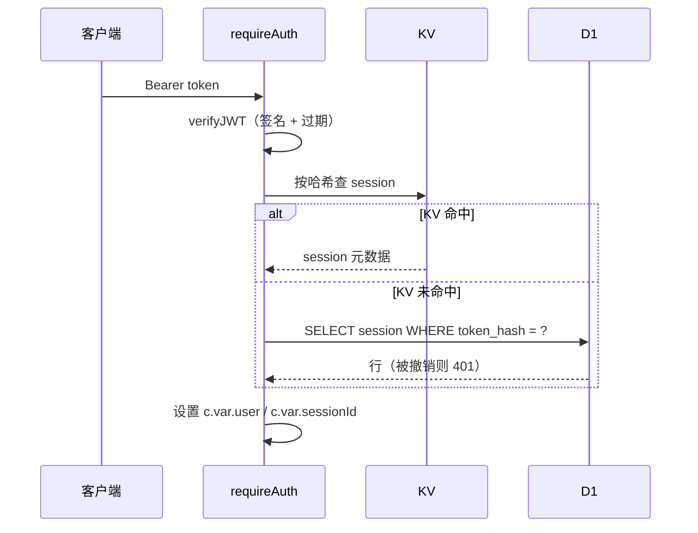

# 架构

## 概览

Prism 是一个 monorepo，包含两个主要部分：

- **后端**（`worker/`）— 使用 [Hono](https://hono.dev) 编写的 Cloudflare Worker（TypeScript）
- **前端**（`src/`）— 基于 Vite 构建的 React 19 SPA，由 Cloudflare Assets 提供静态资源；**首屏 HTML 由同一个 Worker 服务端渲染**



一次 `wrangler deploy` 即可同时发布 Worker 与构建产物。构建脚本会在 Vite 打包后的 worker 输出旁生成一份可直接部署的 `wrangler.json`，从而保留 Vite 的 SSR 处理。

## 请求流程

assets 绑定上设了 `html_handling: "none"` — Cloudflare 默认的「自动回退到 `index.html`」被关掉了，所以每个 HTML 路由都由 Worker 自行渲染。`/assets/` 下的哈希文件以及显式命名的静态文件（`/favicon.svg`、`/pow.wasm` 等）依然由 Cloudflare Assets 直接服务，不会进入 Worker。



Worker 在渲染前会读取 session cookie，若已登录则预拉用户信息，再连同 locale 与预取数据一并交给 React 渲染 — 已登录用户不会再看到「未登录闪烁」。

[Cloudflare Vite 插件](https://developers.cloudflare.com/workers/vite-plugin/) 在 `bun dev` 时把 Worker 与 Vite 进程内部一起跑，无需另起 `wrangler dev`，且 `entry-server.tsx` 享有热更新。

## Worker 结构

```text
worker/
├── index.ts                # 入口；CORS、secureHeaders、路由挂载、scheduled()、email()
├── ssr.ts                  # SSR 胶水 → src/entry-server.tsx
├── types.ts                # D1 行类型、Variables、SiteConfig
│
├── db/migrations/
│   └── 0001_init.sql … 0046_oauth_source_icon.sql
│
├── lib/
│   ├── config.ts           # getConfig()、setConfigValues()、JWT 密钥、RSA 密钥对（KV）
│   ├── secretCrypto.ts     # AES-GCM 信封 + keyed HMAC（SECRETS_KEY）
│   ├── crypto.ts           # randomId、PBKDF2 哈希
│   ├── pow.ts              # 签名挑战签发/校验（HMAC + 过期 + 单次）
│   ├── jwt.ts              # signJWT / verifyJWT（HS256），ID Token RS256
│   ├── totp.ts             # TOTP / HOTP（RFC 6238），备用码
│   ├── webauthn.ts         # 通过 @simplewebauthn/server 处理 Passkey
│   ├── gpg.ts              # GPG clearsign 校验（mldsa.ts 提供 ML-DSA 支持）
│   ├── mldsa.ts            # ML-DSA（后量子）签名校验
│   ├── email.ts / imap.ts  # 发送（Resend/Mailchannels/SMTP）+ 接收（Email Workers / IMAP 轮询）
│   ├── notifications.ts    # 用户邮件 + Telegram 通知
│   ├── notificationRules.ts# 规则集引擎 — 通配符、账号、send/drop、stop
│   ├── webhooks.ts         # 出站 webhook 投递与签名
│   ├── proxyImage.ts       # 关闭式图片代理映射
│   ├── safeFetch.ts        # SSRF 防护（屏蔽 RFC1918 / link-local 等）
│   ├── imageValidation.ts  # 拒绝可疑图片 URL / SVG 负载
│   ├── teamRequirements.ts # 站点底线 + 团队级加入门槛合并
│   ├── domainOwnership.ts  # DNS TXT、HTML meta、.well-known 三种验证方式
│   ├── domainVerify.ts     # cron 重新核验（cron/reverify.ts 入口）
│   ├── githubReadme.ts     # 拉取并缓存 GitHub 用户仓库 README，遵守 ETag
│   ├── sudo.ts             # 步骤提升宽限期存储于 KV
│   ├── scopes.ts           # scope ↔ claim 映射 + 跨应用 scope 解析
│   ├── redirectUri.ts      # OAuth redirect URI 校验，已注册域名检查
│   ├── cookies.ts          # Session cookie 工具
│   └── logger.ts           # 请求日志中间件
│
├── middleware/
│   ├── auth.ts             # requireAuth / requireAdmin / optionalAuth
│   ├── captcha.ts          # verifyCaptchaToken() — 分发到对应 provider
│   └── rateLimit.ts        # KV 滑动窗口限流（IPv6 感知）
│
├── cron/
│   ├── reverify.ts         # 域名重新核验
│   └── imap-poll.ts        # 从 IMAP 拉取验证邮件
│
├── handlers/
│   └── email.ts            # Cloudflare Email Workers 处理器（verify-<code>@<host>）
│
└── routes/
    ├── init.ts             # 首次初始化
    ├── auth.ts             # 注册、登录、TOTP、Passkey、GPG、会话、PoW
    ├── oauth.ts            # 授权服务器、token、OIDC、步骤提升 2FA、/me/* API
    ├── apps.ts             # OAuth 应用 CRUD + scope 定义/访问规则
    ├── teams.ts            # 团队 + 子团队（parent_team_id）、成员、邀请、转让、团队的域名/应用；导出 getEffectiveMember / dissolveTeam
    ├── domains.ts          # 域名验证（TXT/meta/well-known）
    ├── connections.ts      # 社交 OAuth 流（含 Telegram）
    ├── user.ts             # 资料、头像、改密、邮箱、通知、PAT、webhook
    ├── users.ts            # GET /api/users/:username（公开资料 JSON）
    ├── public-teams.ts     # GET /api/public/teams/:id（公开团队 JSON）
    ├── gpg.ts              # GPG 公钥管理（session-auth）
    ├── public.ts           # /users/:username.gpg、/favicon 等
    ├── proxy.ts            # GET /api/proxy/image/:id（关闭式图片代理）
    ├── site.ts             # GET /api/site（公开站点配置）
    ├── assets.ts           # /api/assets/* — 头像/应用图标
    ├── wellknown.ts        # /.well-known/openid-configuration、jwks.json
    └── admin.ts            # 配置、用户、应用、团队、审计、请求日志、密钥迁移
```

## 数据模型

Schema 位于 `worker/db/migrations/`。新部署按顺序执行所有迁移；既有部署只跑新增的迁移。要点：

### `users`

身份主表。`password_hash` 可空（社交登录创建的账号没有密码）。`role` 取 `user` 或 `admin`。

`kind` 区分真实用户（`user`）与 team-as-user 合成行（`kind = 'team'`，id 等于 `teams.id`）。`kind = 'team'` 行的存在仅是为了让 `oauth_apps.owner_id` 在个人/团队应用上能用同一张表 join；它们没有密码、没有会话、没有社交连接、不能登录。

`users` 行还携带公开资料的开关（`profile_is_public`、`profile_show_*`）、自写 README（`profile_readme`、`profile_readme_source`）以及按用户的 OAuth token TTL 覆写。

### `sessions`

`id` 与所颁发 JWT 中的 `sessionId` 声明一致，是认证中间件每次请求时查找的键。`token_hash` 为 `SHA-256(token)`，单凭泄漏的数据库行无法被重放为有效令牌。登出或管理员撤销时该行被删除，即使 JWT 尚未过期也会失效——因为中间件每次请求都会再次到 D1 校验会话。

### `totp_authenticators` / `user_totp_recovery`

`totp_authenticators` 每个已注册的认证器一行（迁移 0004 中由 `totp_secrets` 重命名而来，支持每用户多个认证器）；`enabled = 0` 表示设置流程尚未完成。`user_totp_recovery` 每个用户一行，存储 `backup_codes`——这是一个 JSON 数组，元素为 `$sha256$…` 前缀的 SHA-256 哈希（使用一次后即被删除），或在引入哈希之前留下的明文备用码（旧数据）。

### `passkeys`

WebAuthn 凭据。`credential_id` 用 base64url。每次成功认证后更新 `counter` 用于克隆检测。

### `gpg_keys`

注册的 GPG 公钥，用于 `gpg-login` 与联邦化的 `/users/:u.gpg` 查询。借助 `lib/mldsa.ts` 同时支持 ML-DSA（后量子）公钥。`gpg_challenge_prefix` 可在 clearsign 文本中插入额外行，让用户能验证自己签的挑战来自你的站点。

### `oauth_apps`

用户注册的应用。`client_secret` 在数据库中用 AES-GCM（`SECRETS_KEY`）加密，比对走 `secretCrypto.ts` 中的恒定时间封装。`is_verified` 由管理员设置。`team_id` 非空表示团队应用。`oidc_fields` 控制 ID Token 中嵌入哪些 scope-gated claim。`use_jwt_tokens` 切换签发的是 JWT（RS256）还是 opaque（仅 introspect）。`allow_self_manage_exported_permissions` 允许应用以 HTTP Basic 自管 scope 定义。

### `oauth_codes` / `oauth_2fa_challenges` / `oauth_2fa_codes`

短时（10 分钟）授权码。步骤提升 2FA 有独立的挑战与 code 表，行动文本和 redirect URI 在服务端创建挑战时即被钉死，而非由跳转链接决定。

### `oauth_tokens`

访问令牌和刷新令牌。默认情况下 `access_token` 是随机不透明字符串，每次 API 请求都会在该表中查找；存储值在数据库中以 keyed-HMAC 哈希形式保存（未迁移的明文行继续工作）。应用可以通过将 `oauth_apps.use_jwt_tokens` 设为 1，启用后量子的 **ML-DSA-65** 签名 JWT 访问令牌（RFC 9068 `at+JWT`）；即便如此，`oauth_tokens` 行仍然保留以便在两种模式下都能撤销（`jti` 与 `oauth_tokens.id` 对应）。`users` 上的按用户 TTL 覆写优先于站点默认值。

### `oauth_consents`

记录用户已为某客户端批准过哪些 scope；用于跳过重复的同意页。

### `personal_access_tokens`

长期 API token，前缀 `prism_pat_`。以 keyed-HMAC 哈希存储；明文仅在创建时一次性显示。

### `oauth_sources`

**Admin → OAuth Sources** 中配置的 OAuth 提供方：内置（GitHub、Google、Microsoft、Discord、Telegram、X）以及 Generic OIDC、Generic OAuth 2。每个源拥有自己的 slug、启用状态，OIDC/OAuth2 还含 issuer / auth / token / userinfo URL。同一类型可以有多个源。`client_secret` 加密存储。

### `domains`

用户/团队添加的域名，用于 OAuth redirect URI 校验。`verification_method` 是 `dns-txt`、`html-meta`、`well-known` 之一。重新核验时使用最初采用的方法。

团队为已验证父域（包括 — 当 `inherit_team_domains` 开启时 — 任意上级团队的已验证父域）添加子域时，新行会直接落库为已验证状态，`verified_by_parent` 记录所用的父域。

### `teams` / `team_members` / `team_invites`

`teams` 承载团队名/描述/头像、公开资料主开关 `profile_is_public`、所有 `profile_show_*` 分区覆写（`NULL` 跟随站点默认，`0`/`1` 表示团队显式选择）、加入门槛字段（`require_2fa`、`require_verified_email`，启用站点底线后再被向上钳制）以及让嵌套生效的 **`parent_team_id`**。

- `parent_team_id` 是自引用外键，`ON DELETE CASCADE`（迁移 `0047_sub_teams.sql`）。`parent_team_id` 上有索引，`WHERE parent_team_id = ?` 查询很便宜。顶层团队此字段为 `NULL`；循环和超深嵌套在 API 层拒绝（服务端上限 = `max_team_depth`，默认 5；递归 helper 外层有硬护栏 `ANCESTOR_WALK_LIMIT = 64`，即便数据被破坏也不会失控）。
- `profile_show_sub_teams`（迁移 `0048_sub_team_config.sql` 加入）沿用与其它 `profile_show_*` 字段相同的 `NULL`/`0`/`1` 三态。

`team_members` 每个 `(team_id, user_id)` 一行，`role` ∈ `owner | co-owner | admin | member`，`show_on_profile` 是用户主开关 `profile_show_joined_teams` 的按团队覆写。

`team_members` 只记录**直接**成员资格。继承访问在读时由 `getEffectiveMember`（位于 `routes/teams.ts`）计算：沿 `parent_team_id` 从团队向上走到根，挑用户在整条链上拥有的最高角色。`listEffectiveTeamMemberships` 反向操作 —— 先取直接成员资格，再把每条扩展成其后代子树，用以呈现“我通过继承能看到的团队”。两个 helper 都遵循 `inherit_team_membership` 站点配置；关闭时退化为仅看直接行。

`team_invites` 是标准的随机 token + 过期 + 最大次数表；token 在数据库里以 keyed-HMAC 哈希存储（`__HASH_v1__…`），单凭被盗数据库行无法伪造加入。签发 `role = co-owner` 的邀请要求签发者本人是 `owner`；admin/member 等级对 admin+ 开放。

团队的应用与域名归属仍走原本的字段（`oauth_apps.team_id`、`domains.team_id`）—— 子团队继承**不会**复制行。团队域名列表会把上级团队拥有的域名作为只读条目带上 `inherited_from` 标记返回（受 `inherit_team_domains` 控制）。

#### 子团队语义速览

| 行为                 | 开关                                                                    | 默认值 | 关闭时                                                    |
| -------------------- | ----------------------------------------------------------------------- | ------ | --------------------------------------------------------- |
| 整个特性是否可用     | `enable_sub_teams`                                                      | `true` | 所有子团队接口返回 403；`parent_team_id` 行保留但被忽略。 |
| 成员角色向下级联     | `inherit_team_membership`                                               | `true` | 有效角色 = 仅直接行。                                     |
| 已验证域名向下级联   | `inherit_team_domains`                                                  | `true` | 子团队域名列表和自动验证只看本团队拥有的行。              |
| 公开资料中展示子团队 | `default_team_profile_show_sub_teams` + 团队的 `profile_show_sub_teams` | `true` | 公开团队资料省略 `sub_teams` 数组。                       |

解散团队走递归的 `dissolveTeam`：自下而上，每一层先把它的 OAuth 应用重新分配给该层自己的 owner（若没有则给执行删除的用户），再删除 `kind = 'team'` 的 user 行，最后才删 `teams` 行。`parent_team_id` 上的数据库级联是“双保险”的第二道防线 —— 真正负责在级联过程中不让团队应用被 `oauth_apps.owner_id → users.id ON DELETE CASCADE` 顺带删掉的是应用层的这个循环。

### `social_connections`

绑定的第三方账号。`(user_id, slug)` 唯一 — 同一用户对同一源 slug 仅能绑定一次。`(slug, provider_user_id)` 也唯一，避免同一外部账号绑到多个 Prism 用户。

### `user_emails`

按用户的次要邮箱，每行带 `verified`、`verify_token`、`verify_code`（后者用于「用户主动发邮件」验证路径）。主邮箱仍保留在 `users.email` 上以兼容历史。

### `webhooks` / `webhook_deliveries`

用户与管理员 webhook 共享同一表（通过 `user_id IS NULL` 区分）。投递为 best-effort，HMAC-SHA256 签名，留存供审计。

### `app_event_queue` / `app_webhooks`

应用通知（`user.token_granted`、`user.token_revoked`、`user.updated`）的出站扇出。队列同时驱动 per-app webhook 与 SSE / WebSocket 流。

### `notification_rules`（旧）/ `notification_rulesets`

`user_notification_prefs` 同时承载历史的事件 → 等级映射，以及当前规范的 `notification_rules` JSON。`notification_rulesets` 是命名规则集表 — 一组按顺序遍历的 `match` / `action` / `stop` 规则。详见 [通知](notifications.md)。

### `image_proxy_mappings`

图片代理不再是开放中继。所有外引头像 / 图标都先在服务端注册一条映射（`registerImageProxyMapping`），把原始 URL 映射成不透明 ID。`/api/proxy/image/:id` 对未在表中的请求返回 404。Cron 会清理源行已被删除的孤儿映射。

### `site_config`

扁平 KV 表。值为 JSON 字符串，确保 boolean / number 能正确往返。`secretCrypto.ts` 中 `SENSITIVE_CONFIG_KEYS` 列出的键写入时 AES-GCM 加密，读取时由 `getDecryptedConfig()` 透明解密。

### `audit_log` / `request_logs` / `login_errors`

三张相互独立的诊断表。`audit_log` 是高层「重要状态变化」记录。`request_logs` 是 Worker 每次请求的运维遥测（method、path、status、耗时、IP、UA、可选的用户/审计关联）。`login_errors` 记录失败认证尝试，保留时长由 `login_error_retention_days` 控制。

### `pow_used`

单次使用的 PoW nonce。原子 `INSERT OR IGNORE` 防重放；过期行由 cron 清理。

## 认证流程



每次需要鉴权的请求：



## PoW（工作量证明）

PoW 是第三方验证码服务的替代方案。

1. `GET /api/auth/pow-challenge` — 服务器返回 `{ challenge, difficulty, expires_at }`。`challenge = base64url(payload || HMAC-SHA256(secret, payload))`，其中 `payload = version(1) || expiry_be64(8) || random(16)`。HMAC 密钥由 JWT secret 拼上 `\0pow-v1` 派生而来。签发时不写任何服务端状态。
2. 客户端调用 `solvePoW(challenge, difficulty)`：按 `navigator.hardwareConcurrency`（最多 8）开启对应数量的 Web Worker；第 `k` 个 Worker 搜索 `k, k+N, k+2N, …` 编号的 nonce。每个 Worker 优先用 WASM（`pow/src/lib.rs`，sha2 crate，`Sha256::clone()` 缓存中间状态），失败时回退到等价 trick 的同步 JS SHA-256。最先命中者胜出，其余被终止。
3. 客户端把 `{ pow_challenge, pow_nonce }` 与注册/登录请求一并提交。
4. 服务端 `verifyPowChallenge()`：解码 → 重算 HMAC 并恒定时间比较 → 校验过期 → 用 `INSERT OR IGNORE` 在 `pow_used` 中原子声明 16 字节 payload nonce（防重放）→ 检查 `SHA-256(challenge_string || nonce_be32)` 是否有 `difficulty` 个前导零比特。Cron 清理已过期的 `pow_used` 行。

## 数据库中的密钥

敏感字段分为两类，根都在 `SECRETS_KEY` 这一 Cloudflare Secrets Store 绑定：

- **可还原（AES-GCM 信封）** — Worker 需要*读出明文*：OAuth/源 `client_secret`、验证码私钥、SMTP/IMAP 密码、GitHub README PAT。密文以 `__ENC_v1__` 开头。
- **仅校验（keyed HMAC-SHA256）** — Worker 只需对一个候选值做*比较*：PAT、OAuth 访问/刷新 token、OAuth code、邀请 token、邮箱验证 token、二次验证码、单条备用码。哈希以 `__HASH_v1__` 开头。HMAC 子密钥通过 HKDF 从 `SECRETS_KEY` 派生（info 串 `prism:hash-subkey:v1`）以做域分隔。

未绑定 `SECRETS_KEY` 时这些工具退化为 no-op，历史明文行依然可比对 — 已存在的部署只需新增绑定 + 在管理面板点一次迁移即可启用加密。

## 安全说明

- 所有密码学操作均基于 **Web Crypto API** 和 `@noble/post-quantum`——不依赖 Node.js `crypto` 模块
- 密码使用 **PBKDF2** 哈希（100,000 次迭代，SHA-256，16 字节随机盐）
- 会话 JWT 使用 **HMAC-SHA256** 签名；签名密钥存放在 KV 中
- OIDC ID 令牌默认使用 **ML-DSA-65**（后量子，FIPS 204）签名；为兼容旧客户端也保留了 RS256（JWKS：`/.well-known/jwks.json`）
- OAuth 访问令牌默认是随机不透明字符串；应用可启用后量子的 **ML-DSA-65** 签名 JWT（RFC 9068 `at+JWT`）
- TOTP 按 RFC 6238 使用 **HMAC-SHA1**，允许 ±1 步长窗口；备用码以 SHA-256 哈希存储
- PKCE 使用 **S256**（向后兼容也接受 plain）
- 限流使用基于 KV 的滑动窗口，IPv6 按 `ipv6_rate_limit_prefix`（默认 `/64`）聚合
- 每次已认证请求都会向 D1 重新校验会话——删除会话行可立即让尚未过期的 JWT 失效
- 所有 redirect URI 在签发 code 前都会与应用注册列表 + 域名归属验证状态进行匹配
- 图片代理是关闭式的：仅服务已注册映射，杜绝 SSRF 中继
- 经图片代理转出的 SVG 会被消毒（移除 `<script>`、事件处理器、`javascript:` 伪 URL、`<foreignObject>`、外链 `<use>`）
